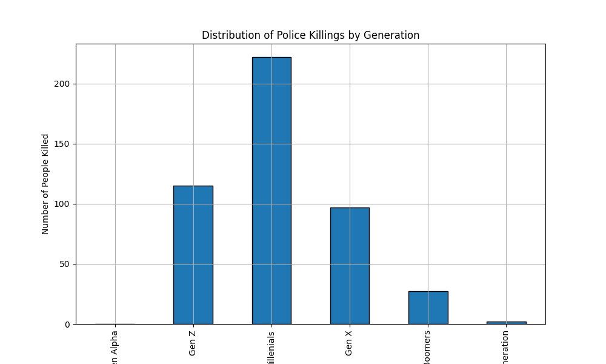

# Police Killings Summary Report:

# Summary statistics of age of people killed by police
Category: age
Mean: 37.36717062634989
Median: 35.0
Std: 12.997134298989726
Min: 16.0
Max: 87.0

# Gender Distribution of People Killed by Police:
| gender   |   count |
|:---------|--------:|
| Male     |     445 |
| Female   |      22 |

# Police Killings Summary Report:

# Summary statistics of age of people killed by police
Category: age
Mean: 37.36717062634989
Median: 35.0
Std: 12.997134298989726
Min: 16.0
Max: 87.0

# Gender Distribution of People Killed by Police:
| gender   |   count |
|:---------|--------:|
| Male     |     445 |
| Female   |      22 |

# Police Killings Summary Report:

# Summary statistics of age of people killed by police
Category: age
Mean: 37.36717062634989
Median: 35.0
Std: 12.997134298989726
Min: 16.0
Max: 87.0

# Gender Distribution of People Killed by Police:
| gender   |   count |
|:---------|--------:|
| Male     |     445 |
| Female   |      22 |

