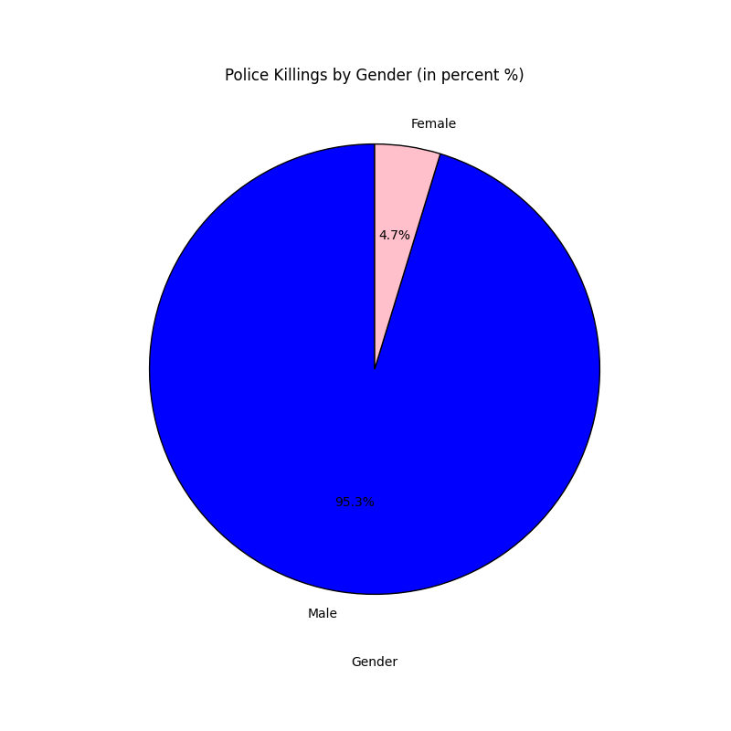

Describe:
|       |      age |
|:------|---------:|
| count | 463      |
| mean  |  37.3672 |
| std   |  12.9971 |
| min   |  16      |
| 25%   |  28      |
| 50%   |  35      |
| 75%   |  45      |
| max   |  87      |

